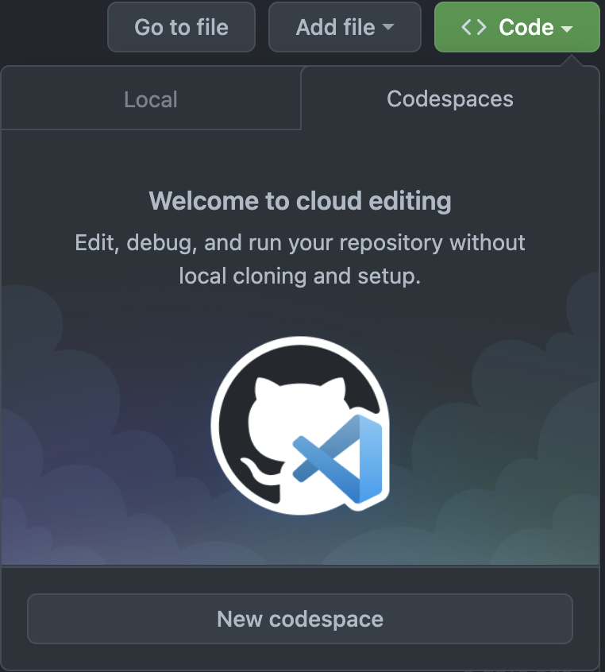

# NestJS / Docker Template
This is a template for a NestJS project that leverages Docker / Github Codespaces for a dev environment.

The .devcontainer directory specifies the Codespaces configuration. This makes jumping into the codebase effortless. You don't even need to clone to your local machine.

As for Docker, the dockerfile is a pretty typical two stage build process for the app itself. The compose file wires up local dependencies (in this template that is DynamoDB, but you can add or remove as needed) and starts the app. The app service in the compose file mounts the root directory as a volume and overrides the command for the dockerfile. This is necessary to facilitate hot reloading even when the app is running inside of a docker container.

All of this is done to facilitate a positive developer experience. The entire development environment is extremely portable. All dependencies are entirely self contained.

## Getting Started

#### Open repo in Codespace
To try this out in a new codespace:



1. Scroll to the top of this page and click the "Code" button.
2. Click the "Codespaces" tab
3. Click the "New codespace" button

#### Start the app
To start the app:
1. Copy the .env.example file to .env (it contains no secrets, but I wanted to follow the best practice of not committing .env) by running `cp .env.example .env`
2. Run `docker-compose up`
3. Open command pallet (`CMD+SHIFT+P`), type `ports` and hit `Return` to open the "Ports" view
4. Find the service running on port `3000`, right click and select "Open in Browser". This will take you to the Swagger docs of your running app via the Github Codespace proxy.

As I mentioned, this setup enables Hot Reloading. You can try this by editing the [title of the API docs](https://github.com/benjibuiltit/nest-docker-template/blob/main/src/main.ts?#L14) and then refreshing the docs tab.

Finally, because the app is running in a Docker container, you'll need to run your npm scripts indirectly. For example to run tests, run `docker exec -it npm run test`. This opens up an interactive terminal with the container and then executes the `npm run test` command.


<p align="center">
  <a href="http://nestjs.com/" target="blank"></a>
</p>

[circleci-image]: https://img.shields.io/circleci/build/github/nestjs/nest/master?token=abc123def456
[circleci-url]: https://circleci.com/gh/nestjs/nest

  <p align="center">A progressive <a href="http://nodejs.org" target="_blank">Node.js</a> framework for building efficient and scalable server-side applications.</p>
    <p align="center">
<a href="https://www.npmjs.com/~nestjscore" target="_blank"></a>
<a href="https://www.npmjs.com/~nestjscore" target="_blank"></a>
<a href="https://www.npmjs.com/~nestjscore" target="_blank"></a>
<a href="https://circleci.com/gh/nestjs/nest" target="_blank"></a>
<a href="https://coveralls.io/github/nestjs/nest?branch=master" target="_blank"></a>
<a href="https://discord.gg/G7Qnnhy" target="_blank"></a>
<a href="https://opencollective.com/nest#backer" target="_blank"></a>
<a href="https://opencollective.com/nest#sponsor" target="_blank"></a>
  <a href="https://paypal.me/kamilmysliwiec" target="_blank"></a>
    <a href="https://opencollective.com/nest#sponsor"  target="_blank"></a>
  <a href="https://twitter.com/nestframework" target="_blank"></a>
</p>
  <!--[](https://opencollective.com/nest#backer)
  [](https://opencollective.com/nest#sponsor)-->

## Description

[Nest](https://github.com/nestjs/nest) framework TypeScript starter repository.

## Installation

```bash
$ npm install
```

## Running the app

```bash
# development
$ npm run start

# watch mode
$ npm run start:dev

# production mode
$ npm run start:prod
```

## Test

```bash
# unit tests
$ npm run test

# e2e tests
$ npm run test:e2e

# test coverage
$ npm run test:cov
```

## Support

Nest is an MIT-licensed open source project. It can grow thanks to the sponsors and support by the amazing backers. If you'd like to join them, please [read more here](https://docs.nestjs.com/support).

## Stay in touch

- Author - [Kamil Myśliwiec](https://kamilmysliwiec.com)
- Website - [https://nestjs.com](https://nestjs.com/)
- Twitter - [@nestframework](https://twitter.com/nestframework)

## License

Nest is [MIT licensed](LICENSE).
